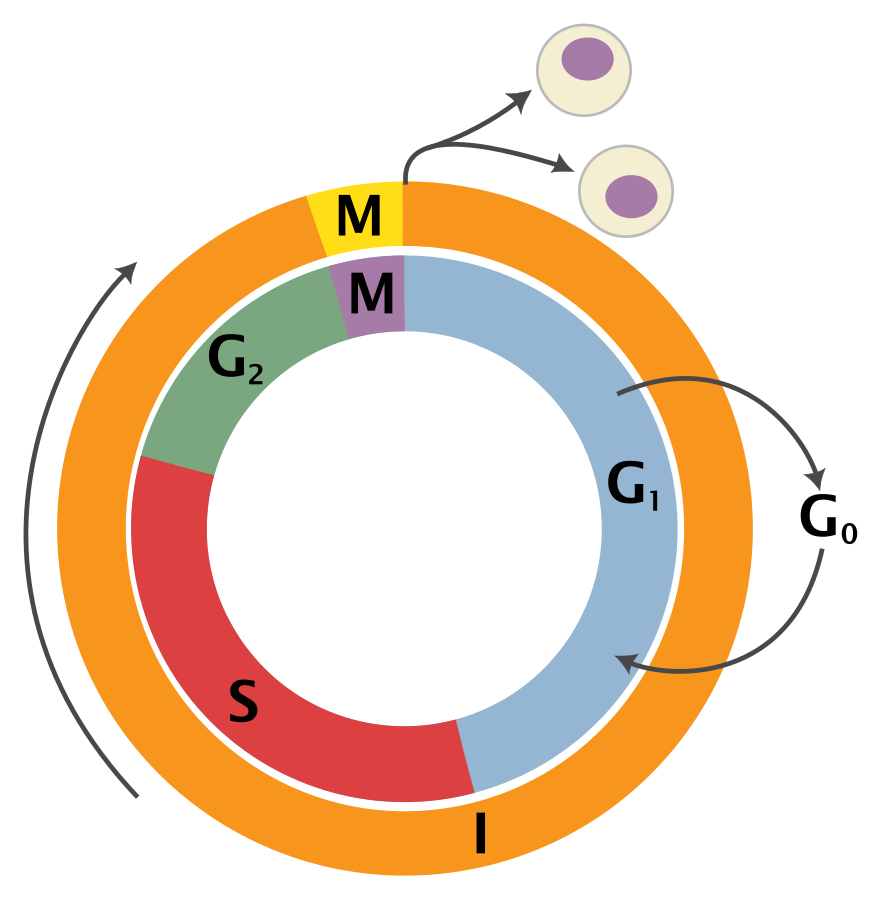
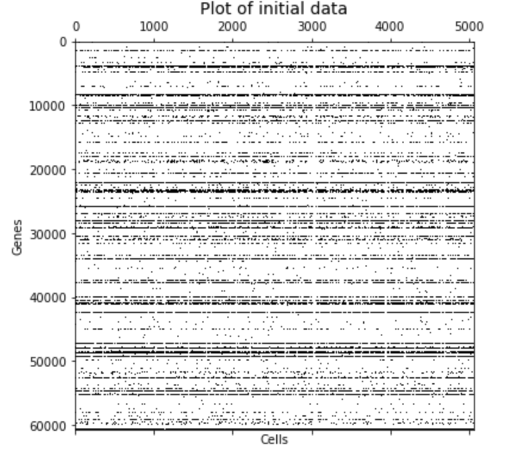
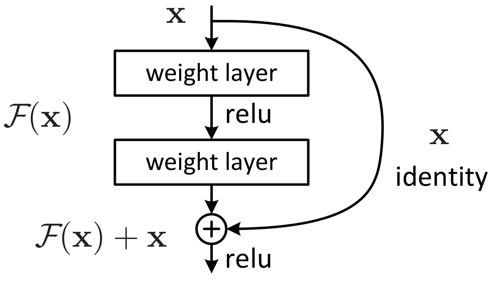
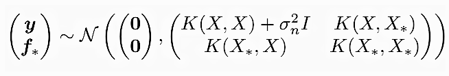
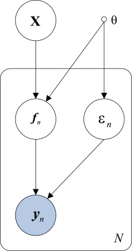

# Abstract
------------------------------------------------------

Advances in omics technologies make it possible to study cellular dynamics, providing accurate information on which genes encoded in our DNA are turned on or off in the continuously changing transcriptome. In particular, RNA-seq provides a powerful means to analyze molecular mechanisms underlying cell-state transitions, leading to an unprecedented opportunity to reveal latent biological processes. As a result, the reconstruction of cell development processes from RNA sequences has attracted much attention in recent years. Still, it remains a challenge due to the heterogeneous nature of the processes. The underlying idea in most methods proposed is that there is a biological process responsible for the main variations in the data. Then the goal is to infer the trajectory of that process in the gene expression space so that its effects can be removed. It allows the delineation of other cell subpopulations, which can be crucial to studying tumor evolution. This project explores computational techniques for pseudo-time inference of the cell cycle process from RNA sequences. This study presents different unsupervised approaches to this problem: an autoencodr approach, an autoencoder with residual neural networks and a Bayesian Gaussian process latent variable approach.

# Introduction
------------------------------------------------------

Cells are the basic structural and functional units of life. Cells can be divided into two main types: eukaryotic, which contain a nucleus, and prokaryotic cells, which do not have a nucleus, but a nucleoid region is still present. The prokaryotic cells are simpler and smaller than eukaryotic cells and characterize mainly bacteria and archaea, two of the three domains of life. On the other hand, the eukaryotic cells are wider and more complex than prokaryotic ones and are present in plants, animals, fungi, protozoa, and algae. The eukaryotic cells are different in types, sizes, and shapes. However, for descriptive purposes, the concept of a generalized cell is introduced. A cell consists of three parts:
* The **cell membrane** separates the material inside the cell from the material outside the cell. It maintains the integrity of a cell and controls the passage of materials into and out of the cell.
* The **nucleus**, formed by a nuclear membrane around a fluid nucleoplasm is the control center of the cell. It contains deoxyribonucleic acid (DNA), the genetic material of the cell.
* The **cytoplasm**, a gel-like fluid inside the cell. It is the medium for chemical reaction and contains the **organelles** each of which has a specific role in the function of the cell.

The cell cycle is the most fundamental biological process underlying the existence and propagation of life in time and space. The cell cycle is a 4-stage process consisting of Gap 1 (G1), synthesis (S), Gap 2 (G2), and mitosis (M), which a cell undergoes as it grows and divides. After completing the cycle, the cell either starts the process again from G1 or exits the cycle through G0, a state of quiescence.

|  | 
|:--:| 
| *cell cycle* |

* **G0** is a resting phase. In this phase, the cell has left the cycle and has stopped dividing. The cell cycle always starts with this phase. Cells in multicellular eukaryotes generally enter the quiescent G0 state from G1 and may remain quiescent for long periods, possibly indefinitely.
* **G1** is the first phase of the interphase (the phases between two M phases). G1 indicates the end of the previous M phase until the beginning of DNA synthesis, it is often also called the growth phase. During the G1 phase, the biosynthetic activities of the cell resume at a high rate. The cell increases its supply of proteins, increases the number of organelles, and grows in size. At the end of the G1 phase, a cell has three options. To continue cell cycle and enter S phase or to stop cell cycle and enter G0 phase for undergoing differentiation.
* **S** phase is characterized by DNA replication and protein synthesis as well as rapid cell growth. 
* **G2** phase in which the cell checks if there is any DNA damage within the chromosomes. In case of any anomaly, the cell will repair the DNA or trigger the apoptosis of the cell.
* **M** (mitotic phase) which consists of nuclear division. Mitosis is the process by which a eukaryotic cell separates itself into two identical daughter cells.

# Previous results
The Cyclum program analyzes a cell-gene expression matrix using an autoencoder network, which projects the cells onto a nonlinear periodic trajectory, where the
pseudo-times of the cells in a periodic process can be more accurately determined than with linear approaches, such as PCA. Cyclum can be used to identify genes associated with the periodic process and additionally the program can treat the inferred periodic process as a confounder and deconvolve its effects from scRNA-seq data.[1]

Cyclum is a model-based approach that fits the data to predefined circular manifolds, this design makes it more robust to handle random noise and small sample sizes, these features make Cyclum useful to constructing the Human Cell Atlas, the Human Tumor Atlas, and other cell ontologies.[1]
# Dataset description and preprocessing
---------------------------------------------------------------
In the following part we will show the two datasets we used for our project. The two databases contained cells information, in particular the second one contains information about the cell phase while the first one doesn't. For this reason we used the second one to create the model, while in the first one we tried to detect the cell phase with our model.

# First dataset

|            | cell 1 | cell 2 | cell 3 | cell 4 | ... |
|------------|--------|--------|--------|--------|-----|
| total_UMIs | 37509  | 34809  | 85843  | 48921  | ... |
| count 1    | 0      | 0      | 0      | 0      | ... |
| count 2    | 0      | 0      | 0      | 0      | ... |
| count 3    | 0      | 0      | 0      | 0      | ... |
| ...        | ...    | ...    | ...    | ...    | ... |

Table: *First rows and columns of CHLA9 dataset*

The dataset used in our analysis is *CHLA9.loom*, containing information about more than 5000 different cells. Notice that the initial format of our data is a loom format, designed to efficiently hold large omics datasets. As shown in the table above, each column of the dataset describes a different cell and it is named and identified by a unique string, part of which corresponds to the DNA sequence of the cell. For each column of the dataset (for each cell) we have more than 60000 positive natural numbers associated with it. Each of these numbers represents a specific count of genes inside the cell. Finally, for each cell, we also have an attribute called "TotalUMIs" (one of the counts) representing the sum of the aforementioned counts. This number is often introduced in omic datasets since most of the gene counts are zero: our dataset is **sparse**.

|  | 
|:--:| 
| *dataset sparsity* |

Each row of our dataset is indexed by a list of keys. Among them, we decided to **filter** our initial dataset so that it contains only the counts of the genes whose genetype is 'protein_encoding' since, according to literature, it is generally easier to predict the phase of their cycle and since we have a huge number of these genes.
Moreover, we filtered the dataset using the attributed "TotalUmis", deleting all the cells with several counts outside the *25%-75%* interquantile range. Here below we show the boxplot used to filter the dataset and the genetype distribution.

<iframe src="assets/plots/subplots_dataset_preprocessing.html" width="100%" height="720"> </iframe>

The reason why we filtered the cells with a too small or too large number of genes is due to the fact that the phase of those cells could be more difficult to determine when the number of these observed genes does not lie inside the *25%-75%*. Indeed, if the count was outside this range, we could have too few or too many genes to take into account in our future models and therefore we could easily underfit or overfit the data.
Moreover, we removed from our dataset the half of the genes of our dataset (half of the rows) that had the bigger number of zeros inside them because, with the same argument as before, we would like to focus on the genes which are sufficiently observed in our dataset. 
Finally, as suggested by our supervisor, we applied a standardization technique often used in the omic domain. For each cell, we divided each count of genes (each column of our dataframe) by the total number of the counts of the genes inside the cell. In this way, we now have to deal with real values in the interval [0,1] instead of discrete values which could cause problems when applying Machine Learning models to them. Additionally, since we had values close to zero in the entries of our dataframe, we added to all the entries the minimum value in all the entries of the dataframe and, subsequently, we applied a log transformation elementwise. This standardizing procedure will allow us to work with real values sufficiently far from zero, allowing us to avoid numerical issues.

# Second dataset

The dataset is composes of 930 cell, across three cell lines. The cell lines consist of transformed cell populations with the ability to divide indefinitely. They have great utility in research and have led to numerous important discoveries throughout medicine. In particular, the three cell type we’re considering are H9, MDA-MB-231 and PC3. For each of these cell lines we dispose of a dataset with a certain number of cell, each of that is charachterized by its name (index value) and its description given by 253 genes (columns). For each cell we also are provided with the cycle phases they are in, that can be G0/G1,S or G2/M, which has been found measuring the DNA content. The proportion of cells in the phases vary between the type of cell. For example, the percentage of cells in the G0/G1 phase is 54% for the PC3 dataset and 73% for the H9 dataset.

The 253 genes are the result of a filtering process applied on a total of 333 genes. The cell cycle associated genes are 119/333, which provides information of the entire cell cycle. The non-cell-cycle associated genes are 214/333 and have primary roles in the inflammatory response and housekeeping controls.

In the scatter plots below we used the TSNE method (t-Distributed Stochastic Neighbor Embedding), which is a technique for dimensionality reduction that is particularly well suited for the visualization of high-dimensional datasets.

- __H9 (HTB-176)__: is a cutaneous human cell affected by lymphoma desease. This dataset contains 227 cells.
 
 
-	__MDA-MB-231 (HTB-26)__: is an epithelial human cell of the breast tissue (Mammary gland) affected by adenocarcinoma. This dataset contains 342 cells.
 
 
-	__PC3 (CRL-1435)__: is an epithelial human cell of the prostate tissue affected by adenocarcinoma (Grade IV). This dataset contains 361 cells.
 
 

# Task and methods description
---------------------------------------------------------------

The goal of our project will be to make a pseudotemporal reconstruction of the cells processes from the gene expression profiles obtained by RNA sequences.
Let us, first of all, give some mathematical rigor to the problem. Let us call $$x_n$$ the feature vector of the cell $$n$$ (the gene expression profile), our goal is to determine an embedding mapping $$\phi : Y \to X $$ such that $$\phi(y_n) = x_n$$ where $$Y$$ is the feature space, $$X$$ is the phase space and $$x_n$$ is the phase of the cell $$n$$. Notice that the dimensionality of the feature space $$Y$$ is generally very large ($$60000$$ for CHLA9 dataset) while the $$X$$ space is unidimensional and can be considered homeomorphic to the space $$S_1$$: the unitary circle in the $$xy$$ plane. Notice that we don't have the labels $$x_n$$ described above in practice since they are quite expensive to collect. Therefore, classical supervised learning techniques may not be useful. The problem can be seen as a dimensionality reduction problem, and some of the machine learning techniques for dimensionality reduction such as PCA, autoencoders, and Gaussian process latent variable models seem suitable. However, we should discard from the beginning any linear method such as PCA since the function $$\phi$$ should be periodical and nonlinear. Then, we will apply the following machine learning techniques:
* Autoencoders (a reproduction of the architecture of Liang et al. [1])
* Autoencoders with residual neural networks
* Gaussian process latent variable models (GPLVM)

We will now describe how these methods work, we will discuss the architecture used and the obtained results when they are applied to our specific use case.

# Autoencoders
-----------------------------------------------------------------

Liang, Wang, Han, Chen in their paper "Latent periodic process inference from single-cell RNA-seq data" [1] proposed Cyclum, an autoencoder model to learn the one dimensional circular approximation of the cell phase. Let us first analyze the theory behind autoencoders.
Autoencoders are an unsupervised learning technique in which neural networks are used for the task of representation learning. Specifically, a neural network architecture will be designed so that we have a **bottleneck** in the network which forces a compressed knowledge representation of the original input.

|  | 
|:--:| 
| *autoencoder architecture* |

As shown in the image, the autoencoder is essentially composed of two distinct parts: the encoder part and the decoder part. Each of the two parts is a neural network with a varying number of layers and neurons. The goal of the encoder is to reduce the dimensionality of the input (an image of a number in the figure) mapping the input $$x$$ into the lower dimensional representation $$z$$. Calling then $$X$$ the input space and $$Z$$ the space of reduced dimensionality, the goal of the encoder is to learn a mapping $$f_1$$ such that $$f_1 : X \to Z$$ and $$f_1(x) = z$$. On the other hand, the goal of the decoder is to reconstruct from the representation $$z$$ the original input $$x$$ learning a function $$f_2 : Z \to X$$ such that $$f_2(z) = x'$$ where $$x'$$ is "close" to $$x$$. Ideally, $$x'$$ should be $$x$$ but this is not possible in practice (otherwise we could compress each image or video into any arbitrary small dimension). The two mapping $$f_1$$ and $$f_2$$ are found by training a neural network such that the reconstruction error (the objective function) 
$$
\sum_{n=1}^{N}||\mathbf{y}_{n}-\hat{\mathbf{y}}_{n}||^{2}
$$
is minimized. Notice that, to prevent overfitting, a regularization term is often included in the objective function.
Additionally, autoencoders are powerful methods for dimensionality reduction. Indeed, it can be shown that if we don't apply any nonlinear activation function in the decoder part, the results of PCA and autoencoders (the representation $$z$$) are the same.

We tried to reproduce the work of Liang et al. [1] therefore recreating Cyclum: the autoencoder used by the authors. As suggested, we adopted an asymmetrical autoencoder. The encoder is composed of three layers with a decreasing number of neurons, the hyperbolic tangent is used as the activation functions. The decoder has two layers: the first one using cosine and sine activation functions and the second one performing a simple linear transformation. 
We use the least square error as the optimization target with L2 regularization, formally:
$$
\underset{\mathbf{w}_{i}, \mathbf{v}}{\operatorname{argmin}} \sum_{n=1}^{N}||\mathbf{y}_{n}-\hat{\mathbf{y}}_{n}||_{2}^{2}+\sum_{i} \alpha_{i}||\mathbf{W}_{i}||_{L}^{2}+\beta||\mathbf{V}||_{L}^{2}
$$
. Where $$W$$ is the weight matrix of the encoder and $$V$$ is the weight matrix of the decoder. The network is implemented using Keras with TensorFlow, which optimizes the parameters using gradient descent.7

### Autoencoders results

Using the model previously presented, we tried to identify the phase of the cells by infering the pseudo time of the circular path modelling the cell cycle. In particular, after having obtained the pseudotime, we divided the cell cycle (and therefore the pseudo-time range) in three main phases: g0/g1, s and g2/m. Then, we could approach the problem as a multiclassification problem and we were able to compute the accuracies when Cyclum model is applied to the three different datasets. Here below we report the results.

|                  | pc3 dataset | mb dataset | H9 dataset |
|------------------|-------------|------------|------------|
| Cyclum model [1] | 0.793       | 0.779      | 0.593      |

Table: *Cyclum results*

As we can see the model is performing quite well on the pc3 and mb datasets, while his accuracy is smaller than $$0.6$$ for the H9 dataset.

Moreover, we applied Cyclum model also to CHLA9 dataset. As we have explained before, we don't have the phase of the cells (the labels) of this dataset and therefore we cannot check the correctness of the results of the predicted pseudo-times. However, the autoencoder seems to be working well since we reach a final mean squared error (between the inputs and the low dimensional representation) of $$0.35$$ which is small compared to the average vector norm of the inputs which is $$1.47$$.

# Autoencoders with residual neural networks
--------------------------------------------------

Another model which we decided to implement was a variant of the autoencoder, that could make the previous method more robust. Like a standard autoencoder, the model is made up of an encoder and a decoder part but, this time, the **residual neural network** approach is applied to the encoder part. The approach consists of adding skipping layers shortcuts between the blocks of the encoder as shown in the image below. In addition the activation functions of the encoder are changed by rectified linear units and the decoder activations are substituted by $$sin(x)^2 + x$$. The modifications that we propose are driven by the following problems that could appear when using  the autoencoder proposed by Liang.

|  | 
|:--:| 
| *Skipping layer example* |

- **Degradation**: It is well known that shallow neural networks are already universal approximators but that  deeper models tend to work better in practice. In our problem, this is very clear, if we want to embed a very high dimensional feature space into the unit circle it must be benefitial to perform the projection progressively. Therefore we can expect deeper networks to be able to represent more complex mappings. However this may attenuate the information signals from the inputs to the outputs, leading to a poor performance. This phenomena was discovered by He et al. [4], who showed that adding more layers to deep neural networks could lead to a decrease in performance (degradation problem). The authors mitigated this problem by adding shortcuts between layers, allowing the network to decrease the information loss through the propagation since identity functions were added to the network as an information summary. This technique is now widely used because it permits the use of deeper neural networks without paying the information loss price. 

- **Singularities**:   One of the problems of neural networks that makes them difficult to interpret or train is the fact that they are not identifiable.  There are many parmeters that induce the same predictior, leading to a loss landscape that presents many singularities.  Elimanating some connections between the layers breaks the permutation symmetry of the nodes, thus relieving the optimization slow-down caused by the degenerated manifolds.

- **Vanishing gradients**: When we apply the chain rule during backpropagation in neural networks the gradient decreases/increases exponentially with the number of layers which produces no change in the parameters when applying gradient descent. As a result we must be very careful when choosing an activation function. The hyperbolic tangent used in Liang saturates at -1 and 1, where the derivative approach 0. In order to solve this issue we use rectified linear units (Relu), that always have derivative  1 when the input is positive, avoiding any shrinkage during backpropagation. In addition, when the inputs are negative they are set to zero, introducing sparsity that has been shown to be very benefitial in the context of neural networks (cite)

- **Bad local minima:** We have already explained that the weight space symmetry of neural networks leads to an a undesirable loss landscape that contains many singularities. This behaviour is already present in monotonic activations like relu or tanh, but if we change them by periodic functions the situation can get worse  as the number of parameters inducing the same predictor will become much larger, generating infinitely more local minima. Moreover (reference) shows that these local minima have usually a high cost in sinusoidal activations (which is not the case in other activations).  To overcome this issue but still capture the periodicity of the cell processes we propose to add $$x$$ to the bottleneck activations ($$sin(x), cos(x)$$) so that we have a monotonic activation. Finally we want to make sure that the activation can capture well the nonlinearities, but  this could not be the case for the choseen activations when we are around 0. For example $$sin(x)$$ behaves almost like $$x$$ for sufficiently small values of $$x$$, making the network approach a linear network when the inputs of the bottleneck are close to zeros. What we propose here is to take $$sin(x)^2$$ to make sure that the activation stays in a  nonlinear regime.

### Results Residual autoencoder

|                      | pc3 dataset | mb dataset | H9 dataset |
|----------------------|-------------|------------|------------|
| residual autoencoder | 0.759       | 0.742      | 0.648      |
| Cyclum model [1]     | 0.793       | 0.779      | 0.593      |

Table: *Results residual autoencoder model*

As we can observe from the table of the results above, using residual autoencoder allows us to gain $$0.055$$ in accuracy in H9 dataset. However, we loose $$0.034$$ and $$0.037$$ in accuracy in the pc3 and mb datasets respectively.

#  GPLVM
--------------------------------

To perform the period inference from the RNA sequences we will use a Bayesan method (GPLVN), which considers stochasticity, does not assume any parametric form of the data but still allows us to introduce prior knowledge about the cells. The Gaussian Process Latent Variable Model (GPLVM) is a dimensionality reduction method that uses a Gaussian process to learn a low-dimensional representation of (potentially) high-dimensional data.

The __Gaussian process__ attempts to describe a directional dependency between a covariate variable $$x$$ and the corresponding observable output $$y$$. For doing that, it sets a Gaussian distribution for $$p(y\vert x)$$ which describes the dependency of an observable $$y$$ for each input $$x \in X$$. This distribution varies in $$x$$, so that we end up with infinite degrees of freedom. In other words, the idea of Gaussian Processes is to learn a distribution over the functions $$f: X \mapsto Y$$.

More formally, we say that stochastic process $$\{S_x;x\in \mathcal{X}\}$$ is a Gaussian process if for every finite set of indices $$x_1,...,x_n$$ in the index set $$\mathcal{X}$$, $$\left(S_{x_1},...,S_{x_n}\right)$$ is a multivariate Gaussian distribution. A Gaussian Process  is completely determined with mean $$m(x)$$ and co-variance functions $$k(x,x^\star)$$ such that $$\left(S_{x_1},...,S_{x_n}\right) \sim \mathcal{N}(\mu_X,K_{XX})$$ (where $$\mu$$ is often considered as zero). Then we can study $$y=f(x)+\epsilon$$, where $$f(x)$$ will be a Gaussian process and $$\epsilon \sim \mathcal{N}(0,\sigma^2)$$ is simply a noise term. In this case $$y$$ is distributed as $$\mathcal{N}(m(x),K(x,x)+\sigma^2I)$$, because of the noise factor.

To infer the relationship between $$x$$ and $$y$$, it considers a training set $$\mathcal{D} = \{(x_i,y_i), i=1,...,n\}$$ and a testing set $$\{x_i^\star, i=1,...,n\}$$, , in particular it wants to learn $$f$$ in order to make predictions on $$f(x^\star)$$. It takes advantage of the marginal likelihood function to compute the posterior distribution of $$y^*$$ for $$x^*$$ conditioned on the information of the data $$\mathcal{D}$$.  

$$
p(y^*|\mathcal{D}, x^*) = \int p(y^*|x^*, f)p(f|D)df
$$

 
which can be solved in closed form because both terms in the integral are Gaussian, leading to the posterior distribution:
 

$$p(y_{\star}\vert, x, x^{\star}, \mathcal{D}) = \mathcal{N}(K_{\star}(K+\sigma^2I)^{-1}y, K_{\star\star}-K_{\star}(K+\sigma^2I)^{-1}K_{\star})$$.

 

|  | 
|:--:| 
| *Gaussian Process* |

The kernels defining the prior distribution usually have hyperparameters that we may want to tune in the case there is no enough prior information to set them. As opposed to many other machine learning methods, to optimize hyperparameters we do not have to resort to grid search or other gradient-free methodologies. Instead, we can take advantage of the previous equation to maximize the marginal likelihood $$p(Y|X)$$ with respet to the kernel hyperparameters 

$$
    \log p(Y|X) = -\frac{1}{2}Y^T(K_{XX}+\sigma^2I)^{-1}Y-\frac{1}{2}\log|K_{XX}+\sigma^2 I|-\frac{N}{2}\log(2\pi)
$$

 
The first term measures the fit of the data, the second term is a model complexity term, and the last one is just a constant. This is very important, as it tells us that gaussian processes when tunned using marginal likelihood are already considering a tradeoff betwen model complexity and data fit.  
 
The following animated image shows how Gaussian processes behave from the prior to the posterior as they observe input data. 
 

The classical setting for Gaussian processes is a supervised problem where we are given pairs of inputs/outputs and we want to infer their relationship. However in our problem we only observe some sequences $$y$$ but have no available examples of the corresponding periods. 
 
The __Latent variable model__ generally refers to a statistical model that relates a set of variables (so-called manifest variables) to a set of latent variables under the assumption that the responses on the manifest variables are controlled by the latent variables. 

The __GPLVM__  goal is to learn the low dimensional representation $$X^{N\times Q}$$ (latent variable) of the data matrix $$Y^{N\times D}$$ , where N and D are the number and dimensionality of training samples, respectively, and Q<<D. The generating process of the training sample $$y_i$$ is still:  

$$
y_i = f(x_i)+ \epsilon
$$
 
 
 Motivated by classical GPs, Gaussian Process Latent Variable Models define a prior over the latent factors $$x$$ and apply the same system of marginalization.
  

 $$
p(y^*|y) = \int \int p(y^*|x, f_x)p(f_x|x)p(x)dxdf_x
$$
 
 
 In order to compute the posterior in close form we make the same assumption as in the classical GPs.
 -  $p(y^*|x, f) \sim \epsilon$ is the distribution of the noise, that we assume to be Gaussian with homogeneous variance.
 -  $p(x) \sim \mathcal{N}(0,\Sigma)$ for some covariance function $$\Sigma$$, is the distribution of the latent factor.
 -  $p(f_x|x) \sim \mathcal{N}(\mu(x), K(x, x))$ is the distribution over the function space. We encode our prior knowledge about the problem in the kernel function K.

The next image shows a representation of the GPLVM as a probabilistic graphical model, in particular $$X$$ is the latent variable, $$y_n$$ is the manifest one and the arrows represent the dependency relation between variables.

|  | 
|:--:| 
| *Latent and manifest variables* |

A crucial point in GPLVM is to set the prior over the latent space and the function space. In the function space the choice is quite clear as we want to favor the periodicity of the relationship between $$x$$ and $$y$$. As a result we used a periodic kernel with flexible hyperparameter
 

k\left(x_{a}, x_{b}\right)=\sigma^{2} \exp \left(-\frac{2}{\ell^{2}} \sin ^{2}\left(\pi \frac{\left|x_{a}-x_{b}\right|}{p}\right)\right)             

              
For the latent factors, we used Gaussians to be able to marginalize in closed form. This should no be a big assumption as we do not have parametric restrictions on the function $$f(x) = y$$ (e.g the Gaussian can be implicitely transformed by $$f$$). Nevertheless we still have to set the mean. If previous information is available, like noisy observations of the cells changepoint (ref) it is always better to use that. However in the case that previous information is not available we propose to set the prior using Uniform Manifold Approximation and Projection techniques (UMAP).

### Results GPLVM

As for the other models we report the results in accuracy when the GPLVM is applied to each of the three datasets. 

|                  | pc3 dataset | mb dataset | H9 dataset |
|------------------|-------------|------------|------------|
| GPLVM            | 0.802       | 0.763      | 0.629      |
| Cyclum model [1] | 0.793       | 0.779      | 0.593      |

Table: *Results GPLVM model*

As we can see, we obtain an improvement in the accuracies for pc3 and H9 datasets. **Overall the model seems to work even better than the Cyclum**. Indeed we gain almost $$0.01$$ of accuracy in the first dataset and $$0.036$$ in H9 dataset even if we loose $$0.16$$ of accuracy in the mb dataset.

# Conclusions
---------------------------------------------------

The project, carried out in collaboration with the lab of computational biology of EPFL, focuses on predicting the phases of the cell cycle given as input a sparse dataset containing information about different genes present in the cells. Inspired by the approach used by Liang et al. [1], we tried several unsupervised Machine Learning models to learn the pseudo-time of the phase: a one dimensional, non linear and periodical representation of the cell. We started by reproducing Cyclum, the autoencoder model using sine and cosine as the activation functions in the decoder to capture the periodicity of the pseudo-times. We applied Cyclum to three different and labelled datasets: pc3, mb and H9 datasets reaching great accuracies. Additionally, we used this model to label the CHLA9 dataset as required by our supervisor. Moreover, we tried to improve Cyclum by implementing a deeper autoencoder with residual neural networks in the encoder part. The performance of this second model were comparable to the Cyclum's one, even if we assist to an improvement in the accuracy in the H9 dataset and a decrease for the pc3 and mb datasets. Finally we proposed a different approach using a gaussian process latent variable model. In this case we noticed an overall improvement in the accuracy of our model.

# References
--------------------------------------------------

[1] Liang, S., Wang, F., Han, J. et al. Latent periodic process inference from single-cell RNA-seq data. Nat Commun 11, 1441 (2020). <a href= "https://doi.org/10.1038/s41467-020-15295-9"> Link to the paper </a>   
[2] Zinovyev,A., Sadovsky, M., Calzone, L., Fouché, A., Groeneveld,C.,S., Chervov, A., Barillot, E., Gorban, A., N., Modeling Progression of Single Cell Populations Through the Cell Cycle as a Sequence of Switches (2021). <a href="https://doi.org/10.1101/2021.06.14.448414"> Link to the paper </a>   
[3] McDavid A, Dennis L, Danaher P, Finak G, Krouse M, et al. (2014) Modeling Bi-modality Improves Characterization of Cell Cycle on Gene Expression in
Single Cells. PLoS Comput Biol 10(7): e1003696. <a href="https://doi.org/10.1371/journal.pcbi.1003696"> Link to the paper </a>   
[4] K. He, X. Zhang, S. Ren and J. Sun, "Deep Residual Learning for Image Recognition," 2016 IEEE Conference on Computer Vision and Pattern Recognition (CVPR), 2016, pp. 770-778, <a href="https://doi.org/10.1109/CVPR.2016.90"> Link to the paper </a>   
[5] Leng, Ning et al. “Oscope identifies oscillatory genes in unsynchronized single cell RNA-seq experiments.” Nature methods 12 (2015): 947 - 950. <a href="https://www.nature.com/articles/nmeth.3549"> Link to the paper </a>   
[6] Liu, Zehua et al. “Reconstructing cell cycle pseudo time-series via single-cell transcriptome data.” Nature Communications 8 (2017) <a href="https://www.nature.com/articles/s41467-017-00039-z"> Link to the paper </a>   
[7] Anafi, Ron C. et al. “CYCLOPS reveals human transcriptional rhythms in health and disease.” Proceedings of the National Academy of Sciences 114 (2017): 5312 - 5317. <a href="https://www.pnas.org/content/114/20/5312"> Link to the paper </a>   
