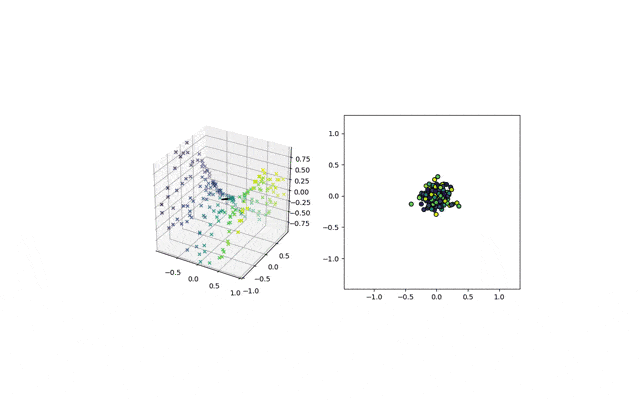

# Abstract
------------------------------------------------------

Advances in omics technologies make it possible to study cellular dynamics, providing accurate information on which genes encoded in our DNA are turned on or off in the continuously changing transcriptome. In particular, RNA-seq provides a powerful means to analyze molecular mechanisms underlying cell-state transitions, leading to an unprecedented opportunity to reveal latent biological processes. As a result, the reconstruction of cell development processes from RNA sequences has attracted much attention in recent years. Still, it remains a challenge due to the heterogeneous nature of the processes. The underlying idea in most methods proposed is that there is a biological process responsible for the main variations in the data. Then the goal is to infer the trajectory of that process in the gene expression space so that its effects can be removed. It allows the delineation of other cell subpopulations, which can be crucial to studying tumor evolution. This project explores computational techniques for pseudo-time inference of the cell cycle process from RNA sequences. This study presents different unsupervised approaches to this problem: an autoencodr approach, an autoencoder with residual neural networks and a Bayesian Gaussian process latent variable approach.

# Introduction
------------------------------------------------------

Cells are the basic structural and functional units of life. Cells can be divided into two main types: eukaryotic, which contain a nucleus, and prokaryotic cells, which do not have a nucleus, but a nucleoid region is still present. The prokaryotic cells are simpler and smaller than eukaryotic cells and characterize mainly bacteria and archaea, two of the three domains of life. On the other hand, the eukaryotic cells are wider and more complex than prokaryotic ones and are present in plants, animals, fungi, protozoa, and algae. The eukaryotic cells are different in types, sizes, and shapes. However, for descriptive purposes, the concept of a generalized cell is introduced. A cell consists of three parts:
* The **cell membrane** separates the material inside the cell from the material outside the cell. It maintains the integrity of a cell and controls the passage of materials into and out of the cell.
* The **nucleus**, formed by a nuclear membrane around a fluid nucleoplasm is the control center of the cell. It contains deoxyribonucleic acid (DNA), the genetic material of the cell.
* The **cytoplasm**, a gel-like fluid inside the cell. It is the medium for chemical reaction and contains the **organelles** each of which has a specific role in the function of the cell.

The cell cycle is the most fundamental biological process underlying the existence and propagation of life in time and space. The cell cycle is a 4-stage process consisting of Gap 1 (G1), synthesis (S), Gap 2 (G2), and mitosis (M), which a cell undergoes as it grows and divides. After completing the cycle, the cell either starts the process again from G1 or exits the cycle through G0, a state of quiescence.

|  | 
|:--:| 
| *cell cycle* |

* **G0** is a resting phase. In this phase, the cell has left the cycle and has stopped dividing. The cell cycle always starts with this phase. Cells in multicellular eukaryotes generally enter the quiescent G0 state from G1 and may remain quiescent for long periods, possibly indefinitely.
* **G1** is the first phase of the interphase (the phases between two M phases). G1 indicates the end of the previous M phase until the beginning of DNA synthesis, it is often also called the growth phase. During the G1 phase, the biosynthetic activities of the cell resume at a high rate. The cell increases its supply of proteins, increases the number of organelles, and grows in size. At the end of the G1 phase, a cell has three options. To continue cell cycle and enter S phase or to stop cell cycle and enter G0 phase for undergoing differentiation.
* **S** phase is characterized by DNA replication and protein synthesis as well as rapid cell growth. 
* **G2** phase in which the cell checks if there is any DNA damage within the chromosomes. In case of any anomaly, the cell will repair the DNA or trigger the apoptosis of the cell.
* **M** (mitotic phase) which consists of nuclear division. Mitosis is the process by which a eukaryotic cell separates itself into two identical daughter cells.

# Dataset description and preprocessing
---------------------------------------------------------------
# First dataset

|            | cell 1 | cell 2 | cell 3 | cell 4 | ... |
|------------|--------|--------|--------|--------|-----|
| total_UMIs | 37509  | 34809  | 85843  | 48921  | ... |
| count 1    | 0      | 0      | 0      | 0      | ... |
| count 2    | 0      | 0      | 0      | 0      | ... |
| count 3    | 0      | 0      | 0      | 0      | ... |
| ...        | ...    | ...    | ...    | ...    | ... |

Table: *First rows and columns of CHLA9 dataset*

The dataset used in our analysis is *CHLA9.loom*, containing information about more than 5000 different cells. Notice that the initial format of our data is a loom format, designed to efficiently hold large omics datasets. As shown in the table above, each column of the dataset describes a different cell and it is named and identified by a unique string, part of which corresponds to the DNA sequence of the cell. For each column of the dataset (for each cell) we have more than 60000 positive natural numbers associated with it. Each of these numbers represents a specific count of genes inside the cell. Finally, for each cell, we also have an attribute called "TotalUMIs" (one of the counts) representing the sum of the aforementioned counts. This number is often introduced in omic datasets since most of the gene counts are zero: our dataset is **sparse**.

|  | 
|:--:| 
| *dataset sparsity* |

Each row of our dataset is indexed by a list of keys. Among them, we decided to **filter** our initial dataset so that it contains only the counts of the genes whose genetype is 'protein_encoding' since, according to literature, it is generally easier to predict the phase of their cycle and since we have a huge number of these genes.
Moreover, we filtered the dataset using the attributed "TotalUmis", deleting all the cells with several counts outside the *25%-75%* interquantile range. Here below we show the boxplot used to filter the dataset and the genetype distribution.

<iframe src="assets/plots/subplots_dataset_preprocessing.html" width="100%" height="720"> </iframe>

The reason why we filtered the cells with a too small or too large number of genes is due to the fact that the phase of those cells could be more difficult to determine when the number of these observed genes does not lie inside the *25%-75%*. Indeed, if the count was outside this range, we could have too few or too many genes to take into account in our future models and therefore we could easily underfit or overfit the data.
Moreover, we removed from our dataset the half of the genes of our dataset (half of the rows) that had the bigger number of zeros inside them because, with the same argument as before, we would like to focus on the genes which are sufficiently observed in our dataset. 
Finally, as suggested by our supervisor, we applied a standardization technique often used in the omic domain. For each cell, we divided each count of genes (each column of our dataframe) by the total number of the counts of the genes inside the cell. In this way, we now have to deal with real values in the interval [0,1] instead of discrete values which could cause problems when applying Machine Learning models to them. Additionally, since we had values close to zero in the entries of our dataframe, we added to all the entries the minimum value in all the entries of the dataframe and, subsequently, we applied a log transformation elementwise. This standardizing procedure will allow us to work with real values sufficiently far from zero, allowing us to avoid numerical issues.

# Second dataset

The dataset is composes of 930 cell, across three cell lines. The cell lines consist of transformed cell populations with the ability to divide indefinitely. They have great utility in research and have led to numerous important discoveries throughout medicine. In particular, the three cell type we’re considering are H9, MDA-MB-231 and PC3. For each of these cell lines we dispose of a dataset with a certain number of cell, each of that is charachterized by its name (index value) and its description given by 253 genes (columns). For each cell we also are provided with the cycle phases they are in, that can be G0/G1,S or G2/M, which has been found measuring the DNA content. The proportion of cells in G0/G1 phases varied from 54% of PC-3 cells to 73% of H9 cells.

The 253 genes are the result of a filtering process applied on a total of 333 genes. The cell cycle associated genes are 119/333, which provide information of the entire cell cycle. The non-cell-cycle associated genes are 214/333 and have primary roles in the inflammatory response and housekeeping controls.

- __H9 (HTB-176)__: is a cutaneous human cell of the prostate tissue affected by lymphoma desease. This dataset contains 361 cells.
 
 
-	__MDA-MB-231 (HTB-26)__: is an epithelial human cell of the breast tissue (Mammary gland) affected by adenocarcinoma. This dataset contains 227 cells.
 
 
-	__PC3 (CRL-1435)__: is an epithelial human cell of the prostate tissue affected by adenocarcinoma (Grade IV). This dataset contains 342 cells.
 
 

# Task and methods description
---------------------------------------------------------------

The goal of our project will be to determine the phase of the cells using the described dataset.
Let us, first of all, give some mathematical rigor to the problem. Let us call $$x_n$$ the feature vector of the cell $$n$$ (the columns of the dataset matrix), our goal is to determine an embedding mapping $$\phi : X \to Y $$ such that $$\phi(x_n) = y_n$$ where $$X$$ is the feature space, $$Y$$ is the phase space and $$y_n$$ is the phase of the cell $$n$$. Notice that the dimensionality of the feature space $$X$$ is generally very large ($$60000$$ for CHLA9 dataset) while the $$Y$$ space is unidimensional and can be considered homeomorphic to the space $$S_1$$: the unitary circle in the $$xy$$ plane. Notice that we don't have the labels $$y_n$$ described above in practice since they are quite expensive to collect. Therefore, the problem can be seen as a dimensionality reduction problem, and some of the machine learning techniques for dimensionality reduction such as PCA, autoencoders, and Gaussian process latent variable models seem suitable. However, we should discard from the beginning any linear method such as PCA since the function $$\phi$$ should be periodical and nonlinear. Then, we will apply the following machine learning techniques:
* Autoencoders (a reproduction of the architecture of Liang et al. [1])
* Autoencoders with residual neural networks
* Gaussian process latent variable models (GPLVM)

We will now describe how these methods work, we will discuss the architecture used and the obtained results when they are applied to our specific use case.

# Autoencoders
-----------------------------------------------------------------

Liang, Wang, Han, Chen in their paper "Latent periodic process inference from single-cell RNA-seq data" [1] proposed Cyclum, an autoencoder model to learn the one dimensional circular approximation of the cell phase. Let us first analyze the theory behind autoencoders.
Autoencoders are an unsupervised learning technique in which neural networks are used for the task of representation learning. Specifically, a neural network architecture will be designed so that we have a **bottleneck** in the network which forces a compressed knowledge representation of the original input.

|  | 
|:--:| 
| *autoencoder architecture* |

As shown in the image, the autoencoder is essentially composed of two distinct parts: the encoder part and the decoder part. Each of the two parts is a neural network with a variable number of layers and neurons. The goal of the encoder is to reduce the dimensionality of the input (an image of a number in the figure) mapping the input $$x$$ into the lower dimensional representation $$z$$. Calling then $$X$$ the input space and $$Z$$ the space of reduced dimensionality, the goal of the encoder is to learn a mapping $$f_1$$ such that $$f_1 : X \to Z$$ and $$f_1(x) = z$$. On the other hand, the goal of the decoder is to reconstruct from the representation $$z$$ the original input $$x$$ learning a function $$f_2 : Z \to X$$ such that $$f_2(z) = x'$$ where $$x'$$ is "close" to $$x$$. Ideally, $$x'$$ should be $$x$$ but this is not possible in practice (otherwise we could compress each image or video into any arbitrary small dimension). The two mapping $$f_1$$ and $$f_2$$ are found by training a neural network such that the reconstruction error (the objective function) 
$$
\sum_{n=1}^{N}||\mathbf{y}_{n}-\hat{\mathbf{y}}_{n}||^{2}
$$
is minimized. Notice that, to prevent overfitting, a regularization term is often included in the objective function.
Additionally, autoencoders are powerful methods for dimensionality reduction. Indeed, it can be shown that if we don't apply any nonlinear activation function in the decoder part, the results of PCA and autoencoders (the representation $$z$$) are the same.

We tried to reproduce the work of Liang et al. [1] therefore recreating Cyclum: the autoencoder used by the authors. As suggested, we adopted an asymmetrical autoencoder. The encoder is composed of three layers with a decreasing number of neurons, the hyperbolic tangent is used as the activation functions. The decoder has two layers: the first one using cosine and sine activation functions and the second one performing a simple linear transformation. 
We use the least square error as the optimization target with L2 regularization, formally:
$$
\underset{\mathbf{w}_{i}, \mathbf{v}}{\operatorname{argmin}} \sum_{n=1}^{N}||\mathbf{y}_{n}-\hat{\mathbf{y}}_{n}||_{2}^{2}+\sum_{i} \alpha_{i}||\mathbf{W}_{i}||_{L}^{2}+\beta||\mathbf{V}||_{L}^{2}
$$
. Where $$W$$ is the weight matrix of the encoder and $$V$$ is the weight matrix of the decoder. The network is implemented using Keras with TensorFlow, which optimizes the parameters using gradient descent.7

### Autoencoders results

Using the model previously presented, we tried to identify the phase of the cells by infering the pseudo time of the circular path modelling the cell cycle. In particular, after having obtained the pseudotime, we divided the cell cycle (and therefore the pseudo-time range) in three main phases: g0/g1, s and g2/m. Then, we could approach the problem as a multiclassification problem and we were able to compute the accuracies when Cyclum model is applied to the three different datasets. Here below we report the results.

|                  | pc3 dataset | mb dataset | H9 dataset |
|------------------|-------------|------------|------------|
| Cyclum model [1] | 0.793       | 0.779      | 0.593      |

Table: *Cyclum results*

As we can see the model is performing quite well on the pc3 and mb datasets, while his accuracy is smaller than $$0.6$$ for the H9 dataset.

Moreover, we applied Cyclum model also to CHLA9 dataset. As we have explained before, we don't have the phase of the cells (the labels) of this dataset and therefore we cannot check the correctness of the results of the predicted pseudo-times. However, the autoencoder seems to be working well since we reach a final mean squared error (between the inputs and the low dimensional representation) of $$0.35$$ which is small compared to the average vector norm of the inputs which is $$1.47$$.

# Autoencoders with residual neural networks
--------------------------------------------------

Another model which we decided to implement was a variant of the autoencoder based-model. Like a standard autoencoder, the model is made up of an encoder and a decoder part but, this time, the **residual neural network** approach is applied to the encoder part. The approach consists of adding skipping layers shortcuts between the blocks of the encoder as shown in the image below.

|  | 
|:--:| 
| *Skipping layer example* |

The advantage of skipping layers in neural networks lies in the fact that when neural networks are deep, we could face the **Degradation problem**. This problem is widely known since He et al. [4] published for the first time a paper proposing an innovative approach to solve this issue. They discovered that adding more layers to deep neural networks could lead to a decrease in performance (degradation problem). The authors mitigated this problem by adding shortcuts between layers, allowing the network to decrease the information loss through the propagation since identity functions were added to the network. This technique is now widely used because it permits the use of deeper neural networks without paying the information loss price. In our case we used 

### Results Residual autoencoder

|                      | pc3 dataset | mb dataset | H9 dataset |
|----------------------|-------------|------------|------------|
| residual autoencoder | 0.759       | 0.742      | 0.648      |
| Cyclum model [1]     | 0.793       | 0.779      | 0.593      |

Table: *Results residual autoencoder model*

As we can observe from the table of the results above, using residual autoencoder allows us to gain $$0.055$$ in accuracy in H9 dataset. However, we loose $$0.034$$ and $$0.037$$ in accuracy in the pc3 and mb datasets respectively.

#  GPLVM
--------------------------------

To perform the period inference from the RNA sequences we will use a Bayesan method (GPLVN), which considers stochasticity and do not assume any parametric form of the data. The Gaussian Process Latent Variable Model (GPLVM) is a dimensionality reduction method that uses a Gaussian process to learn a low-dimensional representation of (potentially) high-dimensional data.

The __Gaussian process__ attempts to describe a directional dependency between a covariate variable $$x$$ and the corresponding observable output $$y$$. For doing that it uses the conditional distribution $$p(y\vert x)$$ which describes the dependency of an observable $$y$$ on a corresponding input $$x \in X$$. 

A random function $$f:X\to \mathbf{R}$$ is a Gaussian Process with mean $$m(x)$$ and co-variance function $$k(x,x^\star)$$ if $$f_{X}=(f(x_1),...,f(x_n)) \sim \mathcal{N}(\mu_X,K_{XX})$$ (where $$\mu$$ is often considered as zero). This method aims to study $$y=f(x)+\epsilon$$, where $$\epsilon \sim \mathcal{N}(0,\sigma^2)$$. In this case $$y$$ is distributed as $$\mathcal{N}(0,K(x,x)+\sigma^2I)$$, because of the noise factor.

To reach those results, it considers a training set $$\{(x_i,y_i), i=1,...,n\}$$ and a testing set $$\{x_i^\star, i=1,...,n\}$$, , in particular it wants to learn $$f$$ in order to make predictions on $$f(x^\star)$$. Furthemore, it takes advantage of the marginal likelihood function $$p(y\vert f, \theta)=\mathcal{N}(f, \sigma^2I)$$, which can be defined because $$f$$ is a GP. The $$\theta$$ variable represent some hyper-parameters contained in the Kernel function and in the noise $$\sigma$$, maximazing the log-likelihood it obtains the optimal value for $$\theta$$. The prediction can be made because the $$f_{\star}$$ distribution is:
$$p(f_{\star}\vert, x, x^{\star}, \theta) = \mathcal{N}(K_{\star}(K+\sigma^2I)^{-1}y, K_{\star\star}-K_{\star}(K+\sigma^2I)^{-1}K_{\star})$$.
Furthermore, it uses the Bayesian marginalization:
$$
p(y^\star \vert x^\star ,x,y)=\int p(y^\star \vert x^\star ,f)p(f\vert x,y)df
$$

|  | 
|:--:| 
| *Gaussian Process* |

The __Latent variable model__ generally refers to a statistical model that relates a set of variables (so-called manifest variables) to a set of latent variables under the assumption that the responses on the manifest variables are controlled by the latent variables. 

The __GPLVM__  goal is to learn the low dimensional representation $$X^{N\times Q}$$ (latent variable) of the data matrix $$Y^{N\times D}$$ , where N and D are the number and dimensionality of training samples, respectively, and Q<<D. The generation process of the training sample $$y_i$$ is:
$$
y_i = f(x_i)+ \epsilon
$$
where $$\epsilon$$ is the noise with gaussian distribution $$ \mathcal{N}(0,\sigma^2)$$.

|  | 
|:--:| 
| *Latent and manifest variables* |

The image above explains the GPLVM, in particular $$X$$ is the latent variable, $$y_n$$ is the manifest one and the arrows represent the dependency relation between variables.
The GPLVM derives from the Gaussian Process but it defines also a prior over the latent factor $$x$$, for this reason, $$p(y\vert x,\theta)$$ can be obtained by using Bayesian theorem and integrating out $$f$$, then it can maximize the marginal likelihood with respect to $$x$$ and the hyper-parameter $$\theta$$.
Furthermore, the Besyan marginalization becomes:
$$
p(y^\star \vert y)=\int \int p(y^\star \vert x ,f)p(f\vert x)p(x)dxdf
$$
where $$p(x)\sim \mathcal{N}(0,\Sigma)$$.

The following animated image shows how a projection mapping over a 2D manifold is learnt over the epochs for data points which were originally in a 3D space.

### Results GPLVM

As for the other models we report the results in accuracy when the GPLVM is applied to each of the three datasets. 

|                  | pc3 dataset | mb dataset | H9 dataset |
|------------------|-------------|------------|------------|
| GPLVM            | 0.802       | 0.763      | 0.629      |
| Cyclum model [1] | 0.793       | 0.779      | 0.593      |

Table: *Results GPLVM model*

As we can see, we obtain an improvement in the accuracies for pc3 and H9 datasets. **Overall the model seems to work even better than the Cyclum**. Indeed we gain almost $$0.01$$ of accuracy in the first dataset and $$0.036$$ in H9 dataset even if we loose $$0.16$$ of accuracy in the mb dataset.

# Conclusions
---------------------------------------------------

The project, carried out in collaboration with the lab of computational biology of EPFL, focuses on predicting the phases of the cell cycle given as input a sparse dataset containing information about different genes present in the cells. Inspired by the approach used by Liang et al. [1], we tried several unsupervised Machine Learning models to learn the pseudo-time of the phase: a one dimensional, non linear and periodical representation of the cell. We started by reproducing Cyclum, the autoencoder model using sine and cosine as the activation functions in the decoder to capture the periodicity of the pseudo-times. We applied Cyclum to three different and labelled datasets: pc3, mb and H9 datasets reaching great accuracies. Additionally, we used this model to label the CHLA9 dataset as required by our supervisor. Moreover, we tried to improve Cyclum by implementing a deeper autoencoder with residual neural networks in the encoder part. The performance of this second model were comparable to the Cyclum's one, even if we assist to an improvement in the accuracy in the H9 dataset and a decrease for the pc3 and mb datasets. Finally we proposed a different approach using a gaussian process latent variable model. In this case we noticed an overall improvement in the accuracy of our model.

# References
--------------------------------------------------

[1] Liang, S., Wang, F., Han, J. et al. Latent periodic process inference from single-cell RNA-seq data. Nat Commun 11, 1441 (2020). <a href= "https://doi.org/10.1038/s41467-020-15295-9"> Link to the paper </a>   
[2] Zinovyev,A., Sadovsky, M., Calzone, L., Fouché, A., Groeneveld,C.,S., Chervov, A., Barillot, E., Gorban, A., N., Modeling Progression of Single Cell Populations Through the Cell Cycle as a Sequence of Switches (2021). <a href="https://doi.org/10.1101/2021.06.14.448414"> Link to the paper </a>   
[3] McDavid A, Dennis L, Danaher P, Finak G, Krouse M, et al. (2014) Modeling Bi-modality Improves Characterization of Cell Cycle on Gene Expression in
Single Cells. PLoS Comput Biol 10(7): e1003696. <a href="https://doi.org/10.1371/journal.pcbi.1003696"> Link to the paper </a>   
[4] K. He, X. Zhang, S. Ren and J. Sun, "Deep Residual Learning for Image Recognition," 2016 IEEE Conference on Computer Vision and Pattern Recognition (CVPR), 2016, pp. 770-778, <a href="https://doi.org/10.1109/CVPR.2016.90"> Link to the paper </a>   
