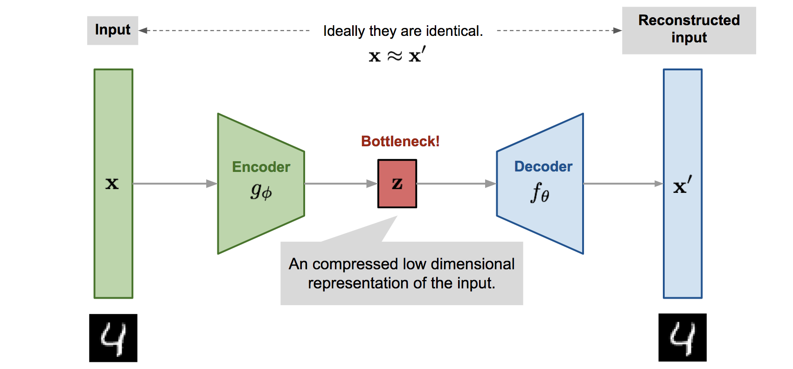

# Abstract
------------------------------------------------------

Advances in omics technologies make it possible to study cellular dynamics, providing accurate information on which genes encoded in our DNA are turned on or off in the continuously changing transcriptome. In particular, RNA-seq provides a powerful means to analyze molecular mechanisms underlying cell-state transitions, leading to an unprecedented opportunity to reveal latent biological processes. As a result, the reconstruction of cell development processes from RNA sequences has attracted much attention in recent years. Still, it remains a challenge due to the heterogeneous nature of the processes. The underlying idea in most methods proposed is that there is a biological process responsible for the main variations in the data. Then the goal is to infer the trajectory of that process in the gene expression space so that its effects can be removed. It allows the delineation of other cell subpopulations, which can be crucial to studying tumor evolution. This project explores computational techniques for pseudo-time inference of the cell cycle process from RNA sequences. This study presents different unsupervised approaches to this problem: an autoencoder approach (), a Generetive adversarial learning approach () and a Bayesian Gaussian process latent variable model based approach ().

# Introduction
------------------------------------------------------

Cells are the basic structural and functional units of life. Cells can be divided in two main types: **eukaryotic**, which contain a nucleus, and prokaryotic cells, which do not have a nucleus, but a nucleoid region is still present. The **prokaryotic** cells are simpler and smaller than eukaryotic cells and characterize mainly bacteria and archaea, two of the three domains of life. On the other hand, the eukaryotic cells are wider and more complex than prokaryotic ones and are present in plants, animals, fungi, protozoa, and algae. The eukaryotic cells are different in types, sizes, and shapes. However, for descriptive purposes, the concept of a **generalized cell** is introduced. A cell consists of three parts:
* The **cell membrane** which separates the material inside the cell from the material outside the cell. It maintains the integrity of a cell and controls passage of materials into and out of the cell.
* The **nucleus** which is formed by a nuclear membrane around a fluid nucleoplasm, is the control center of the cell. It contains the deoxyribonucleic acid (DNA), the genetic material of the cell.
* The **cytoplasm**, a gel-like fluid inside the cell. It is the medium for chemical reaction and contains the **organelles** each of which has a specific role in the function of the cell.

Cell cycle is the most fundamental biological process underlying the existence and propagation of life in time and space. The cell cycle is a 4-stage process consisting of Gap 1 (G1), synthesis (S), Gap 2 (G2) and mitosis (M), which a cell undergoes as it grows and divides. After completing the cycle, the cell either starts the process again from G1 or exits the cycle through G0, a state of quiescence.

|  | 
|:--:| 
| *cell cycle* |

* **G0** is a resting phase. In this phase, the cell has left the cycle and has stopped dividing. The cell cycle always starts with this phase. Cells in multicellular eukaryotes generally enter the quiescent G0 state from G1 and may remain quiescent for long periods of time, possibly indefinitely.
* **G1** is the first phase of the interphase (the phases between two M phases). G1 indicates the end of the previous M phase until the beginning of DNA synthesis, it is often also called the growth phase. During G1 phase, the biosynthetic activities of the cell resume at a high rate. The cell increases its supply of proteins, increases the number of organelles, and grows in size. At the end of G1 phase, a cell has three options. To continue cell cycle and enter S phase or to stop cell cycle and enter G0 phase for undergoing differentiation.
* **S** phase characterized by DNA replication and protein synthesis as well as a rapid cell growth. 
* **G2** phase in which the cell checks if there is any DNA damage within the chromosomes. In case of any anomaly, the cell will repair the DNA or trigger the apoptosis of the cell.
* **M** (mitotic phase) which consists of nuclear division. Mitosis is the process by which a eukaryotic cell separates itself into two identical daughter cells.

# Dataset description and preprocessing
---------------------------------------------------------------

|            | cell 1 | cell 2 | cell 3 | cell 4 | ... |
|------------|--------|--------|--------|--------|-----|
| total_UMIs | 37509  | 34809  | 85843  | 48921  | ... |
| count 1    | 0      | 0      | 0      | 0      | ... |
| count 2    | 0      | 0      | 0      | 0      | ... |
| count 3    | 0      | 0      | 0      | 0      | ... |
| ...        | ...    | ...    | ...    | ...    | ... |

Table: *First rows and columns of CHLA9 dataset*

The dataset used in our analysis is CHLA9.loom, containing information about more than 5000 different cells. Notice that the initial format of our data is a loom format, designed to efficiently hold large omics datasets. As shown in the table above, each column of the dataset describes a different cell and it is named and identified by a unique string, part of which corresponds to the DNA sequence of the cell. For each column of the dataset (for each cell) we have more than 60000 positive natural numbers associated to it. Each of these numbers represents a specific count of genes inside the cell. Finally, for each cell, we also have an attribute called "TotalUMIs" (one of the counts) representing the sum of the aforementioned counts. This number is often introduced in omic datasets since most of the gene counts are zero (our dataset is sparse).

|  | 
|:--:| 
| *dataset sparsity* |

Each row of our dataset is indexed by a list of keys. Among them, we decided to filter our initial dataset so that it contains only the counts of the genes whose genetype is 'protein_encoding' since, according to literature, it is generally easier to predict the phase of their cycle and since we have a huge number of these genes.
Moreover, we filtered the dataset using the attributed "TotalUmis", deleting all the cells with a number of counts outside the 25-75% interquantile range. Here below we show the boxplot used to filter the dataset and the genetype distribution.

<iframe src="assets/plots/subplots_dataset_preprocessing.html" width="100%" height="800"> </iframe>

The reason why we filtered the cells with a too small or too large number of genes is due to the fact that the phase of those cell could be more difficult to determine when the number of these observed genes does not lie inside the 25-75%. Indeed, if the count was outside this range, we could have too few or too many genes to take into account in our future models and therefore we could easily underfit or overfit the data.
Moreover, we removed from our dataset the half of the genes of our dataset (half of the rows) that had the bigger number of zeros inside them because, with the same argument as before, we would like to focus on the genes which are sufficiently observed in our dataset. 
Finally, as suggested by our supervisor, we applied a standardization technique often used in omic domain. For each cell, we divided each count of genes (each column of our dataframe) by the total number of the counts of the genes inside the cell. In this way we now have to deal with real values in the interval [0,1] instead of discrete values which could cause problems when applying Machine Learning models to them. Additionally, since we had values really close to zero in the entries of our dataframe, we added to all the entries the minimum value in all the entries of the dataframe and, subsequently, we applied a log transformation elementwise. This standardizing procedure will allow us to work with real values sufficiently far from zero, allowing us to avoid numerical issues.

# Task and methods description
---------------------------------------------------------------

The goal of our project will be to determine the phase of the cells using the described dataset.
Let us first of all give some mathematical rigor to the problem. Let us call $$x_n$$ the feature vector of the cell $$n$$ (the columns of the dataset matrix), our goal is to determine an embedding mapping $$\phi : X \to Y $$ such that $$\phi(x_n) = y_n$$ where $$X$$ is the feature space, $$Y$$ is the phase space and $$y_n$$ is the phase of the cell $$n$$. Notice that the dimensionality of the feature space $$X$$ is generally very large (in our case $$60000$$) while the $$Y$$ space is unidimensional and can be considered homeomorphic to the space $$S_1$$: the unitary circle in the $$xy$$ plane. Notice that we don't have the labels $$y_n$$ described above in practice since they are quite expensive to collect. Therefore, the problem can be seen as a dimensionality reduction problem and some of the machine learning techniques for dimensionality reduction such as PCA, autoencoders and Gaussian process latent variable models seem suitable. However we should discard from the beginning any linear method such as PCA since the function $$\phi$$ should be periodical and nonlinear. Then, we will apply the following machine learning techniques:
* Autoencoders
* Autoencoders with residual neural networks
* Gaussian process latent variable models (GPLVM)

We will now describe how these methods work, we will discuss the structure and the obtained results when they are applied to our specific use case.

# Autoencoders
-----------------------------------------------------------------

Autoencoders are an unsupervised learning technique in which neural networks are used for the task of representation learning. Specifically, a neural network architecture will be designed so that we have a bottleneck in the network which forces a compressed knowledge representation of the original input.

|  | 
|:--:| 
| *autoencoder architecture* |

As shown in the image, the autoncoder is essentially composed of two distinct parts: the encoder part and the decoder part. Each of the two parts is a neural network with a variable number of layers and neurons. The goal of the encoder is to reduce the dimensionality of the input (an image of a number in the figure) mapping the input $$x$$ into the lower dimensional representation $$z$$. Calling then $$X$$ the input space and $$Z$$ the space of reduced dimensionality, the goal of the encoder is to learn a mapping $$f_1$$ such that $$f_1 : X \to Z$$ and $$f_1(x) = z$$. On the other hand, the goal of the decoder is to reconstruct from the representation $$z$$ the original input $$x$$ learning a function $$f_2 : Z \to X$$ such that $$f_2(z) = x'$$ where $$x'$$ is "close" to $$x$$. Ideally $$x'$$ should be $$x$$ but this is not possible in practice (otherwise we could compress each image or video into any arbitrary small dimension). The two mapping $$f_1$$ and $$f_2$$ are found by training a neural network such that the reconstruction error (the objective function) 
$$
\sum_{n=1}^{N}||\mathbf{y}_{n}-\hat{\mathbf{y}}_{n}||^{2}
$$
is minimized. Notice that, in order to prevent overfitting, a regularization term is often included in the objective function.
Additionally, autoencoders are powerful methods for dimensionality reduction. Indeed, it can be shown that if we don't apply any nonlinear activation function in the decoder part, the results of PCA and autoencoders (the representation $$z$$) are the same.

For our purpose, we create a standard multi-layer perceptron with hyperbolic tangent activation functions, in the decoder we use cosine and sine as the activation functions in the first layer, followed by a second layer performing linear transformations. We use the least square error as the optimization target with L2 regularization, formally:
$$
\underset{\mathbf{w}_{i}, \mathbf{v}}{\operatorname{argmin}} \sum_{n=1}^{N}||\mathbf{y}_{n}-\hat{\mathbf{y}}_{n}||_{2}^{2}+\sum_{i} \alpha_{i}||\mathbf{W}_{i}||_{L}^{2}+\beta||\mathbf{V}||_{L}^{2}
$$
. Where $$W$$ is the weight matrix and $$V$$ is the bias term of the layers/neurons of our neural network. The network is implemented using Keras with TensorFlow, which optimizes the parameters using gradient descent.

# Autoencoders with residual neural networks
--------------------------------------------------

Another model which we decided to implement was a variant of the autoencoder based model. Like a standard autoencoder, the model is made up of an encoder and a decoder part but, this time, the **residual neural network** approach is applied to the encoder part. The approach consists of adding skipping layers shortcuts between the blocks of the encoder as shown in the image below.

|  | 
|:--:| 
| *Skipping layer example* |

The advantage of skipping layers in neural networks lies in the fact that when neural networks are deep, we could face the **Degradation problem**. This problem is widely known since He et al. [4] published for the first time a paper proposing an innovative approach to solve this issue. They discovered that adding more layers to deep neural networks could lead to a decrease in the performance (degradation problem). The authors mitigated this problem by adding shortcuts between layers, allowing the network to decrease the information loss through the propagation since identity function were added to the network. This technique is now widely used because it permits the use of deeper neural network without paying the information loss price. In our case we used 

#  GPLVM
--------------------------------

In order to perform the period inference from the RNA sequences we will use a Bayesan method (GPLVN), which considers stochasticity and do not assume any parametric form of the data. The Gaussian Process Latent Variable Model (GPLVM) is a dimensionality reduction method that uses a Gaussian process to learn a low-dimensional representation of (potentially) high-dimensional data.

The __Gaussian process__ attempts to describe a directional dependency between a covariate variable $$x$$ and the corresponding observable output $$y$$. For doing that it uses the conditional distribution $$p(y\vert x)$$ which describes the dependency of an observable $$y$$ on a corresponding input $$x \in X$$. 

A random function $$f:X\to \mathbf{R}$$ is a Gaussian Process with mean $$m(x)$$ and co-variance function $$k(x,x^\star)$$ if $$f_{X}=(f(x_1),...,f(x_n)) \sim \mathcal{N}(\mu_X,K_{XX})$$ (where $$\mu$$ is often considered as zero). This method aims to study $$y=f(x)+\epsilon$$, where $$\epsilon \sim \mathcal{N}(0,\sigma^2)$$. In this case $$y$$ is distributed as $$\mathcal{N}(0,K(x,x)+\sigma^2I)$$, because of the noise factor.

To reach those results, it considers a training set $$\{(x_i,y_i), i=1,...,n\}$$ and a testing set $$\{x_i^\star, i=1,...,n\}$$, , in particular it wants to learn $$f$$ in order to make predictions on $$f(x^\star)$$. Furthemore, it takes advantage of the marginal likelihood function $$p(y\vert f, \theta)=\mathcal{N}(f, \sigma^2I)$$, which can be defined because $$f$$ is a GP. The $$\theta$$ variable represent some hyper-paraemeters caontained in the Kernel functione and in the noise $$\sigma$$, maximazing the log-likelihood it obtains the optimal value for $$\theta$$. The prediction can be made because the $$f_{\star}$$ distribution is:
$$p(f_{\star}\vert, x, x^{\star}, \theta) = \mathcal{N}(K_{\star}(K+\sigma^2I)^{-1}y, K_{\star\star}-K_{\star}(K+\sigma^2I)^{-1}K_{\star})$$.
Furthermore, it uses the Bayesian marginalization:
$$
p(y^\star \vert x^\star ,x,y)=\int p(y^\star \vert x^\star ,f)p(f\vert x,y)df
$$

|  | 
|:--:| 
| *Gaussian Process* |

The __Latent variable model__ generally refers to a statistical model that relates a set of variables (so-called manifest variables) to a set of latent variables under the assumption that the responses on the manifest variables are controlled by the latent variables. 

The __GPLVM__  goal is to learn the low dimensional representation $$X^{N\times Q}$$ (latent variable) of the data matrix $$Y^{N\times D}$$ , where N and D are the number and dimensionality of training samples, respectively, and Q<<D. The generation process of the training sample $$y_i$$ is:
$$
y_i = f(x_i)+ \epsilon
$$
where $$\epsilon$$ is the noise with gaussian distribution $$ \mathcal{N}(0,\sigma^2)$$.

|  | 
|:--:| 
| *Latent and manifest variables* |

  

 

  

 | 
|:--:| 
| *Latent and manifest variables* |

The image above explain the GPLVM, in particular $$X$$ is the latent variable, $$y_n$$ the manifest one and the arrows represent the dependency relation between variables.
The GPLVM derives from the Gaussian Process but it defines also a prior over the latent factor $$x$$, for this reason $$p(y\vert x,\theta)$$ can be obtained by using Bayesian theorem and integrating out $$f$$, then it can maximize the marginal likelihood with respect to $$x$$ and the hyper-parameter $$\theta$$.
Furthermore, the Besyan marginalization becomes:
$$
p(y^\star \vert y)=\int \int p(y^\star \vert x ,f)p(f\vert x)p(x)dxdf
$$
where $$p(x)\sim \mathcal{N}(0,\Sigma)$$.

# References
--------------------------------------------------

[1] Liang, S., Wang, F., Han, J. et al. Latent periodic process inference from single-cell RNA-seq data. Nat Commun 11, 1441 (2020). <a href= "https://doi.org/10.1038/s41467-020-15295-9"> Link to the paper </a>   
[2] Zinovyev,A., Sadovsky, M., Calzone, L., Fouché, A., Groeneveld,C.,S., Chervov, A., Barillot, E., Gorban, A., N., Modeling Progression of Single Cell Populations Through the Cell Cycle as a Sequence of Switches (2021). <a href="https://doi.org/10.1101/2021.06.14.448414"> Link to the paper </a>   
[3] McDavid A, Dennis L, Danaher P, Finak G, Krouse M, et al. (2014) Modeling Bi-modality Improves Characterization of Cell Cycle on Gene Expression in
Single Cells. PLoS Comput Biol 10(7): e1003696. <a href="https://doi.org/10.1371/journal.pcbi.1003696"> Link to the paper </a>   
[4] K. He, X. Zhang, S. Ren and J. Sun, "Deep Residual Learning for Image Recognition," 2016 IEEE Conference on Computer Vision and Pattern Recognition (CVPR), 2016, pp. 770-778, <a href="https://doi.org/10.1109/CVPR.2016.90"> Link to the paper </a>   
